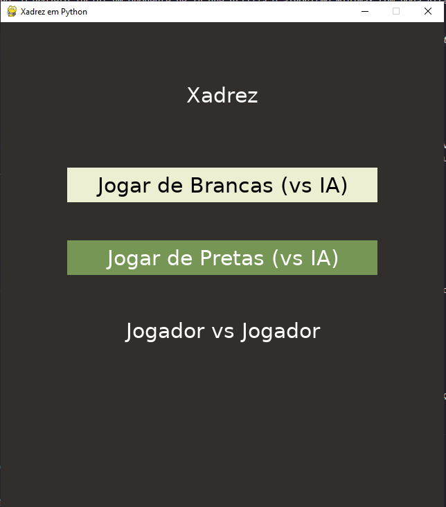
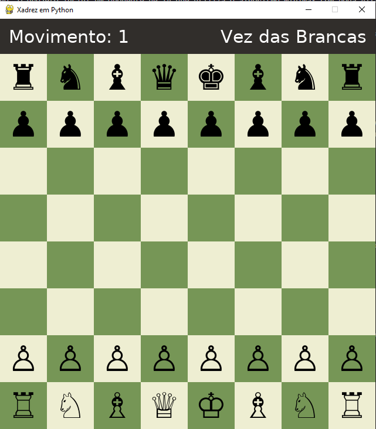

# Xadrez em Python com IA Minimax

Um jogo de xadrez completo desenvolvido em Python, utilizando a biblioteca **Pygame** para a interface gráfica e **python-chess** para a validação de regras e lógica do jogo. O projeto inclui um oponente de IA que utiliza o algoritmo Minimax com poda Alfa-Beta para a tomada de decisões.




---

## Funcionalidades

- **Interface Gráfica Completa:** Tabuleiro e peças desenhados com Pygame, sem a necessidade de arquivos de imagem externos (usa caracteres Unicode).
- **Dois Modos de Jogo:** Jogue contra a Inteligência Artificial ou em um modo local **Jogador vs. Jogador (PvP)**.
- **IA Inteligente:**
  - Oponente que utiliza o algoritmo **Minimax com Poda Alfa-Beta** para calcular a melhor jogada.
  - A profundidade da busca da IA é configurável.
  - Função de avaliação que considera tanto o **valor material** das peças quanto o seu **valor posicional** (Piece-Square Tables).
  - Lógica para evitar empates por repetição e comportamento menos previsível.
- **Feedback Visual Completo:**
  - Destaques para a peça selecionada.
  - Indicação de todos os movimentos legais (círculos cinzas).
  - Indicação de capturas possíveis (círculos vermelhos).
  - Destaque visual para o Rei quando em xeque.
  - **Coordenadas (a-h, 1-8)** posicionadas nos quatro lados do tabuleiro.
- **Experiência de Jogo Aprimorada:**
  - Perspectiva do tabuleiro que vira automaticamente para o jogador da vez.
  - Painel superior com contador de movimentos e indicador de turno.
  - Pequeno delay no movimento da IA para tornar a jogada mais fácil de interpretar.
- **Controles Avançados de Jogo:**
  - Botão para **voltar a jogada** (Undo), que desfaz um turno completo no modo vs. IA.
  - Botão para **reiniciar a partida** a qualquer momento.
  - Painel de histórico de movimentos com **rolagem (scroll)** usando a roda do mouse para ver a partida completa.
- **Ciclo de Jogo Completo:**
  - Menu inicial para seleção de modo e cor.
  - Janela com **redimensionamento dinâmico** entre o menu e a tela de jogo.
  - Pop-up de fim de jogo com **motivos detalhados de empate** (Rei Afogado, Regra dos 75 Movimentos, etc.).
  - Opção de **revisar o tabuleiro final** antes de reiniciar a partida.

---

## Tecnologias Utilizadas

- **Python 3**
- **Pygame:** Para toda a parte gráfica e de interatividade.
- **python-chess:** Para a representação do tabuleiro, geração de movimentos legais, e verificação de estados (xeque, xeque-mate, empate, etc.).

---

## Instalação e Execução

Para rodar este projeto na sua máquina, siga os passos abaixo.

**1. Clone o Repositório**

```bash
git clone [https://github.com/seu-usuario/seu-repositorio.git](https://github.com/seu-usuario/seu-repositorio.git)
cd seu-repositorio
```

_(Substitua pela URL do seu repositório)_

**2. Instale as Bibliotecas**
Este projeto depende de duas bibliotecas principais. Você pode instalá-las usando `pip`:

```bash
pip install pygame python-chess
```

**3. Baixe a Fonte (Essencial)**
As peças do xadrez são renderizadas usando caracteres Unicode, que não estão presentes em todas as fontes padrão. Nós utilizamos a fonte **DejaVu Sans**.

- **Baixe a fonte aqui:** [DejaVu Sans Font Family](https://www.1001fonts.com/dejavu-sans-font.html)
- Após baixar e extrair o arquivo `.zip`, encontre o arquivo **`DejaVuSans.ttf`** e coloque-o **na mesma pasta** onde está o seu arquivo `main.py`.

**4. Execute o Jogo**
Com as dependências e a fonte no lugar, basta executar o script principal:

```bash
python main.py
```

---

## Detalhes da IA

A inteligência artificial foi construída com base no algoritmo **Minimax**, otimizado com **Poda Alfa-Beta**.

- **Função de Avaliação:** A IA decide a "qualidade" de uma posição no tabuleiro através de uma função de avaliação que considera dois fatores principais:
  1.  **Valor Material:** A soma do valor das peças no tabuleiro (Rainha = 9, Torre = 5, etc.).
  2.  **Valor Posicional:** Um bônus ou penalidade aplicado a cada peça com base em sua posição, utilizando _Piece-Square Tables_ (PSTs). Isso incentiva a IA a controlar o centro, proteger seu rei e posicionar as peças em casas estrategicamente vantajosas.
- **Comportamento:** A IA inclui lógicas para evitar empates por repetição e usa aleatoriedade como critério de desempate entre jogadas de mesma pontuação, tornando seu comportamento mais dinâmico.
- **Profundidade de Busca:** A "inteligência" da IA é controlada pela constante `SEARCH_DEPTH` no topo do código. O valor padrão é `3` (1.5 movimentos completos). Aumentar este valor torna a IA mais forte, mas também exige muito mais tempo de processamento para cada jogada.

---

### Autor

Feito por **Erick Valente Sprogis**.
