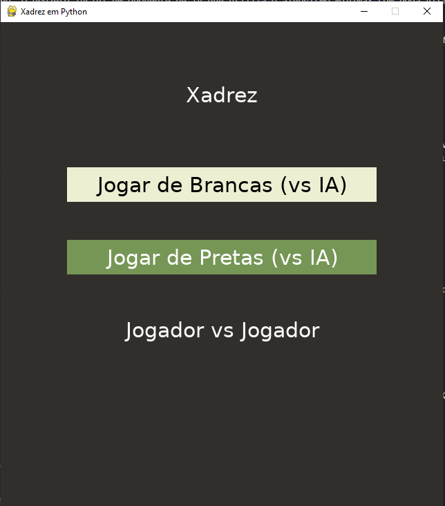
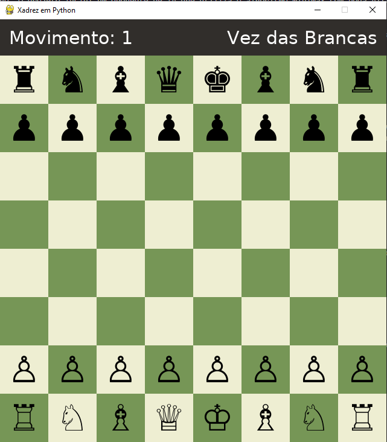

# Xadrez em Python com IA

Jogo de xadrez completo desenvolvido em Python, com interface gráfica em **Pygame**, validação de regras via **python-chess** e um oponente de IA baseado em **Minimax com Poda Alfa-Beta**.




---

## Funcionalidades

### Modos de Jogo

- **Jogador vs. IA** — escolha jogar de Brancas ou Pretas contra o computador.
- **Jogador vs. Jogador (PvP)** — modo local com perspectiva que vira automaticamente a cada turno.

### Inteligência Artificial

- Algoritmo **Minimax com Poda Alfa-Beta** e **Iterative Deepening**: a IA aprofunda a busca enquanto houver tempo, entregando sempre a melhor jogada encontrada dentro do limite.
- **Transposition Table** com hashing Zobrist: posições já avaliadas são reutilizadas, dobrando a profundidade efetiva de busca.
- **Livro de Aberturas** embutido: cobre mais de 55 linhas teóricas (Ruy Lopez, Italiana, Siciliana, KID, Nimzo-Indian, London e mais), tornando o jogo de abertura imediato e variado.
- **Quiescence Search**: evita o efeito horizonte resolvendo todas as capturas antes de emitir uma avaliação.
- **Ordenação de movimentos (MVV-LVA)**: garante que as melhores capturas são testadas primeiro, maximizando a poda.
- Função de avaliação com **valor material** + **Piece-Square Tables** + **mobilidade**.
- **4 níveis de dificuldade** ajustáveis a qualquer momento pelo menu de pausa:

| Nível | Tempo por jogada |
| --- | --- |
| Fácil | 0.5s |
| Médio | 2.0s (padrão) |
| Difícil | 6.0s |
| Muito Difícil | 15.0s |

### Relógio de Xadrez

Cinco controles de tempo selecionáveis no menu principal:

| Botão | Tempo | Modalidade |
| --- | --- | --- |
| ∞ | Ilimitado | Sem relógio |
| 1' | 60s | Bullet |
| 3' | 180s | Blitz |
| 5' | 300s | Blitz |
| 10' | 600s | Rápido |

Contagem regressiva por jogador, alerta vermelho abaixo de 30s e derrota automática por tempo esgotado.

### Feedback Visual

- Destaque da peça selecionada.
- Círculos cinzas nos movimentos legais, círculos vermelhos nas capturas disponíveis.
- Destaque vermelho no Rei quando em xeque.
- **Animação de deslizamento** das peças com easing suave (150ms).
- Coordenadas (a–h, 1–8) nos quatro lados do tabuleiro.
- Painel lateral com histórico de movimentos em notação SAN e rolagem por scroll.

### Feedback Sonoro

Sons gerados sinteticamente (sem arquivos externos):

- **Movimento** — clique suave.
- **Captura** — batida grave.
- **Xeque** — alerta agudo.
- **Fim de jogo** — arpejo descendente.

### Promoção de Peão

Menu visual na coluna da promoção permite escolher **Rainha, Torre, Bispo ou Cavalo**, habilitando subpromoções táticas.

### Salvar e Carregar Partidas (PGN)

- **Exportar PGN** no menu de pausa → salva em `saves/partida_YYYYMMDD_HHMMSS.pgn`, compatível com Lichess, Chess.com e ChessBase.
- **Carregar Partida** no menu principal → lista as 10 partidas mais recentes e abre qualquer uma delas para revisão.

### Controles e Navegação

- **Menu de Pausa** (ESC ou botão ⏸): retornar, reiniciar, mudar dificuldade, exportar PGN ou voltar ao menu.
- **Voltar Jogada (Undo)**: desfaz um turno completo no modo vs. IA.
- **Reiniciar** a qualquer momento sem sair ao menu.
- Pop-up de fim de jogo com motivo detalhado (Xeque-mate, Rei Afogado, Material Insuficiente, Regra dos 75 Movimentos, Repetição, Tempo Esgotado) e opção de revisar o tabuleiro final.

---

## Tecnologias

- **Python 3**
- **Pygame** — interface gráfica, sons e eventos.
- **python-chess** — representação do tabuleiro, geração de movimentos legais, validação de regras e leitura/escrita de PGN.

---

## Instalação e Execução

### 1. Clone o repositório

```bash
git clone https://github.com/Erick-Valente-Sprogis/Chess-AI.git
cd Chess-AI
```

### 2. Instale as dependências

```bash
pip install pygame python-chess
```

### 3. Execute

```bash
python main.py
```

> As peças são renderizadas com caracteres Unicode usando fontes instaladas no sistema (DejaVu Sans, Noto Sans Symbols). Nenhum download de fonte é necessário — se nenhuma fonte compatível for encontrada, o jogo usa a fonte padrão do Pygame como fallback.

---

## Detalhes da IA

A IA usa **Iterative Deepening** com limite de tempo: para cada jogada ela aprofunda a busca (profundidade 1, 2, 3…) enquanto houver tempo disponível, retornando sempre a melhor jogada da última iteração completa. O tempo disponível é o nível de dificuldade escolhido.

**Ordem de decisão:**

1. **Livro de Aberturas** — se a posição atual estiver no livro embutido, retorna imediatamente um movimento teórico (sem calcular).
2. **Minimax com Alfa-Beta** — para posições fora do livro, aprofunda iterativamente com hash move ordering da Transposition Table como primeiro candidato em cada nó.
3. **Quiescence Search** nas folhas — resolve todas as capturas antes de avaliar, evitando ilusões de ganho material.

**Função de avaliação (em pawns):**

| Componente | Peso |
| --- | --- |
| Valor material | Rainha=9, Torre=5, Bispo/Cavalo=3, Peão=1 |
| Piece-Square Tables | ±0.0–0.5 por peça por posição |
| Mobilidade | ±0.05 por movimento legal de diferença |
| Penalidade de repetição | ±0.3 para posição visitada 2× |

---

### Autor

Feito por **Erick Valente Sprogis**.
